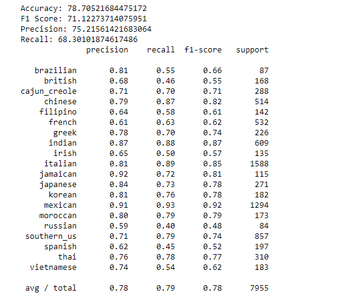
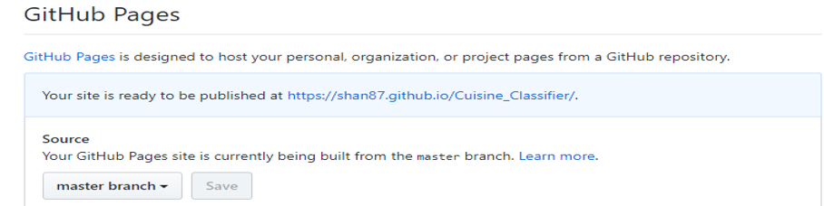
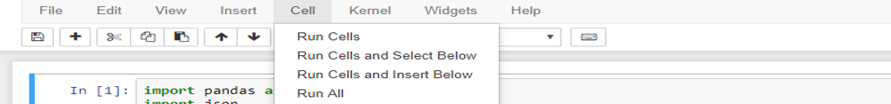
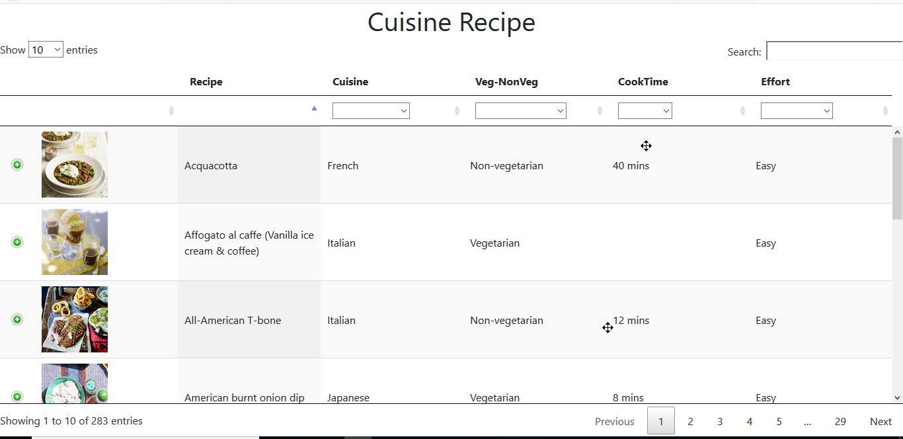
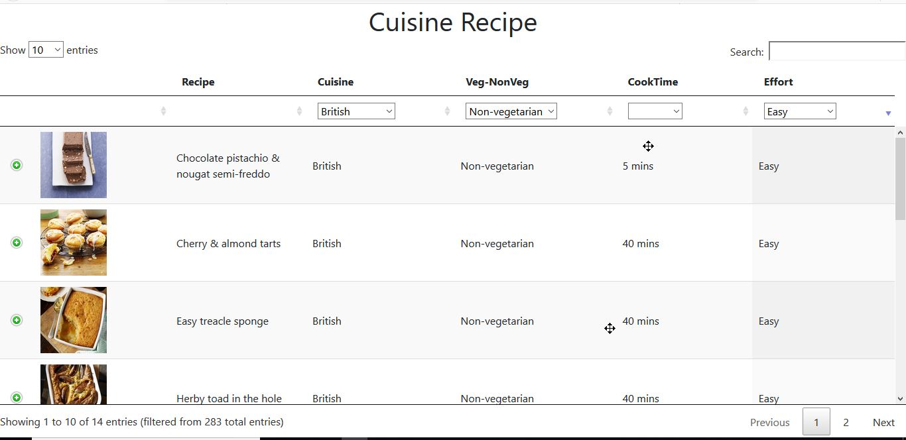
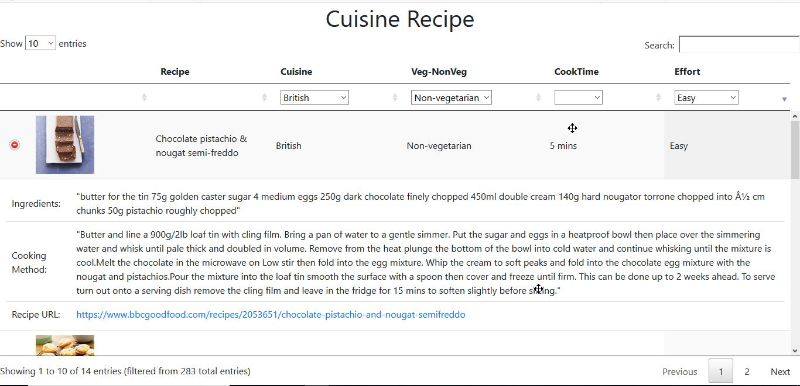

# Cuisine Classifier using Text Mining

## Overview
Digital news articles have become part and parcel of our lives, heavily used by people to retrieve information, express opinions, judgement on any kind of topics. Utilizing the large-scale BIG data from these platforms extensively benefits in performing Data analysis solutions.
The lack of system to classify and filter the set of food related articles makes it challenging for the users to find the desired articles. 

In this project, we have built a classifier model which will classify the food recipes into different cuisines types and whether it is vegetarian or non-vegetarian recipe based on the ingredients used. 

we have also built a web interface to filter and view the classified results and to act as an interface to navigate to the source food recipe article.

## Team Members
- Naveen kumar Palani - Npalani3
- Rama Anem - Ranem2
- Shanthakumar Subramanian - SS81

All the team members contributed equally to the project for the idea generation, dataset selection, model building, building web interface and documentation. It was a combined team effort with equal help and co‐ordination from all the
team members.

All the team members are well versed with the course concepts, providing much needed ideas and
feedback as required while working on the project.

## Data
In this project we are classifying the food reciepe articles available in the [BBC Website](https://www.bbcgoodfood.com/recipes/category/cuisines).

For training the classifier model, we used the data set from [Kaggle](https://www.kaggle.com/c/whats-cooking/data).

## Technologies/Algorithm Used
- Python 3.7.0
- NLTK
- Scikit-learn
- SVM Classifier Algorithm
- Github for version control

## Implementation
- Downloaded the dataset from Kaggle.
- The data is in Json format. Read and stored the data in dictionary and converted it to data frame.
- Did the following feature selection steps using WordNetLemmatizer and regular expression 
  - Removed the punctuation, digits, content inside parenthesis.
- Used rules to add Veg, Non-Veg information to the training data.
- Removed stop words, converted the words to lowercase, applied stemming and tokenized the words using TfidfVectorizer.
- Converted the ingredients column after feature selection into TF-IDF Matrix using TfidfVectorizer.
- Split the data into train and test data in 80:20 ratio.
- Used different machine learning algorithm to find the algorithm which is having high accuracy in classifying the test data.
- SVM algorithm performed better with 78.70% accuracy for the test data compared to Naïve bayes classifier and Logistic regression, so used SVM algorithm to predict the cuisine type.

- Scrapped the news food article from [BBC Website](https://www.bbcgoodfood.com/recipes/category/cuisines) in required format.
- Converted the ingredients column into TF-IDF matrix like the data used for training.
- Predicted the cuisine using the SVM model built using Kaggle data set.
- Stored the result in CSV and used it as the source for our webpage to filter and display the result.

## How to Use
- We have published our work in the below GitHub repository.
  - https://github.com/pnaveen4u87/Cuisine_Classifier
- If you want to use the webpage to filter and view the results, fork the project to your GitHub Id and enable GitHub page in settings for this repository.
- To fork and enable the GitHub pages follow the steps below
  - Fork the project  from https://github.com/pnaveen4u87/Cuisine_Classifier
  - Go to settings of the forked repository
  - Scroll down to GitHub Pages  section and select “master branch” under source and save the settings. This  will generate the URL for you to access the Cuisine classifier UI to view and filter your results.
    
  - The URL generated wont have the complete path. You need to add “cuisine_recipe.html”  to the URL generated by GitHub so that the URL looks something like below
  - https://shan87.github.io/Cuisine_Classifier/cuisine_recipe.html

- The other option is to download the repository and setup the folder in your machine.
- If you download the repository and use the project, you will be able to see the results only in CSV and not in the web.
- To use the tool make sure you have Python and Jupyter notebook installed in your machine.
- The following are the folders/files used by the classifier model
  - #### Main Folder
    - Classifier.ipynb – Jupyter note book to run the classifier
    - OutPut.csv – CSV file where the results will be saved by the classifier
  - #### Main Folder / Data Folder
    - Data folder has 2 folders
      - Train folder which has the train data from Kaggle in json format
      - Test folder which has the test data from BBC website in csv format
- To run the classifier, open the classifier.ipynb in Jupyter notebook
- If you want to provide new training data to the model, you can place the new training data in the train folder in json format like the one which is already available.
- Provide the ingredients for the recipes for which you want find the cuisine type in the csv file in the test folder
- Using Jupyter notebook run all the chunks of code using Run All option in the cell menu

- The classified results will be updated in output.csv
### User Interface
- [Cuisine classifier webpage](https://pnaveen4u87.github.io/Cuisine_Classifier/cuisine_recipe.html) is implemented to view the list of recipes, ingredients which are categorized by the classifier to cuisine type and meal type.
- If you have forked the project, you should access the UI using the URL that is generated  in the GitHub Pages section of your repository settings.
- UI works as below
  - Page is loaded with datatable with all cuisine and recipe data.

  - User can select either Cuisine or Veg-NonVeg or CookTime or Effort or all the options, the table will display the result based on user selection. 

  - The expand/collapse button will reveal information on the Ingredients, Cooking Method and Source recipe URL(link to the recipe)

  
## Limitation
The webpage is a simplified version as it's just a place to deliver the classification result and ideas. The key part of this project is the classification based on the text data and the web page is just a sample model of the real world scenario. The data used in this project is a small set. In real world as the data scales, the efficiency of the classification may vary.

